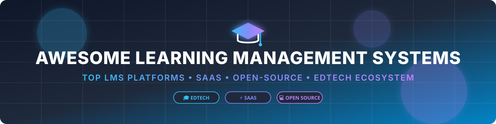

# 🎓 Awesome Learning Management System (LMS)

   

## 🚀 Top Learning Management System (LMS) Platforms & EdTech Ecosystem

**Curated List of SaaS Products & Open-Source GitHub Projects**

*Focused on Course Delivery, Online Learning, K-12 & Higher Education, Corporate Training & Learner Management*

**Last updated: September 2026**

---

This repository tracks notable **SaaS platforms**, **cloud LMS products**, and **open-source projects** for **Learning Management Systems (LMS)**. These platforms enable course delivery, content creation, student enrollment, assessments, grading, analytics, progress tracking, and learner engagement across schools, universities, enterprise corporate training, and vocational institutions.

Whether you are looking for enterprise commercial LMS solutions like Canvas LMS, Blackboard Learn, and Google Classroom, or robust self-hosted open-source software like Moodle and Open edX, this comprehensive directory provides structural market insights, pricing starting points, free plan limits, revenue/valuation scale, and GitHub community metrics.

---

## 📑 Table of Contents
- [📊 Market Overview & Industry Structure](#-market-overview--industry-structure)
- [💼 SaaS & Cloud LMS Platforms](#-saas--cloud-lms-platforms)
- [💻 Open-Source GitHub Projects](#-open-source-github-projects)
- [💡 Decision Guide: Open Source vs SaaS](#-decision-guide-open-source-vs-saas)
- [🤝 How to Contribute](#-how-to-contribute)
- [⚠️ Disclaimer](#%EF%B8%8F-disclaimer)
- [💖 Support & Community](#-support--community)
- [📈 Star History](#-star-history)

---

## 📊 Market Overview & Industry Structure

> 💡 **Market Size & Fragment Dynamics**: The global Learning Management System (LMS) market size is estimated at **~$22.1 Billion (2026)** and is projected to surpass **$45 Billion by 2030** (CAGR ~17.5%). The LMS sector is **moderately fragmented**: higher education and enterprise segments are dominated by a handful of established leaders (Instructure Canvas, Anthology/Blackboard, D2L, Cornerstone, Docebo), while K-12, creator platforms, and niche corporate training exhibit high fragmentation with hundreds of specialized SaaS contenders.

---

## 💼 SaaS & Cloud LMS Platforms

Below is a detailed breakdown of top commercial and SaaS LMS vendors, sorted in **descending order by company scale** (estimated valuation or annual revenue).

| Vendor / Platform | Company / Issuer | Market Scale / Valuation / Revenue (Desc) | Starting Tier Price | Free Tier / Trial Limit | Key Focus & Capabilities |
| :--- | :--- | :--- | :--- | :--- | :--- |
| **[Google Classroom](https://classroom.google.com/)** | Google (Alphabet Inc.) | ~$2.0 Trillion (Market Cap) | $3.00/user/month (Education Standard / Plus) | Free forever (100% free for eligible K-12 & higher-ed institutions with Google Workspace for Education Fundamentals) | Free & simple class management, assignments, and grading tool tightly integrated with Google Docs & Drive. |
| **[Cornerstone Learning](https://www.cornerstoneondemand.com/)** | Clearlake Capital / Cornerstone | ~$5.2 Billion (Acquisition Valuation) | ~$6.00/user/month (Enterprise L&D contracts) | 14-Day Free Trial (Limited enterprise demo sandbox upon request) | Enterprise learning module within Cornerstone HR & talent suite for compliance and professional development. |
| **[Canvas LMS](https://www.instructure.com/canvas)** | Instructure (KKR / Thoma Bravo) | ~$4.8 Billion (Valuation) | ~$5.50/user/year (Institutional enterprise licensing) | Free forever (Free Teacher Account with up to 250 MB course storage and essential grading features) | Dominant LMS in higher education and K-12 with modern UX, LTI integrations, and mobile learning apps. |
| **[PowerSchool Learning / Schoology](https://www.powerschool.com/)** | PowerSchool (Onex / Vista Equity) | ~$4.2 Billion (Acquisition Valuation) | ~$5.00/student/year (School district package) | 14-Day Free Trial (District sandbox demo available upon administrative request) | Comprehensive K-12 learning management and social learning platform with assessment & SIS integration. |
| **[Blackboard Learn](https://www.anthology.com/)** | Anthology Inc. | ~$3.0 Billion (Valuation) | ~$9,000/year (Base institution license starting tier) | 30-Day Free Trial (Instructor Course Preview sandbox access) | Enterprise-grade university LMS with deep analytics, accessibility compliance tools, and multi-tenant management. |
| **[Docebo](https://www.docebo.com/)** | Docebo Inc. (NASDAQ: DCBO) | ~$1.6 Billion (Market Cap) | $25,000/year (Enterprise baseline starting tier for up to 500 active users) | 14-Day Free Trial (Full feature trial with sample course assets, no credit card required) | AI-powered corporate learning platform built for employee onboarding, customer education, and partner training. |
| **[D2L Brightspace](https://www.d2l.com/)** | D2L Inc. (TSX: DTOL) | ~$850 Million (Valuation / Market Cap) | ~$7.00/user/year (Enterprise educational licensing) | 30-Day Free Trial (Full access teacher sandbox for course building and testing) | Next-generation LMS emphasizing outcome-based education, adaptive learning paths, and learning analytics. |
| **[Absorb LMS](https://www.absorblms.com/)** | Absorb Software (Welsh, Carson, Anderson & Stowe) | ~$500 Million (Valuation) | $800/month (~$9,600/year base tier for up to 100 users) | 14-Day Free Trial (Interactive sandbox trial upon enterprise request) | High-performance corporate LMS optimized for compliance, employee development, and external customer training. |
| **[ClassDojo](https://www.classdojo.com/)** | ClassDojo Inc. | ~$1.25 Billion (Valuation) | $4.99/month (ClassDojo Plus for family features) | Free forever (100% free for all teachers, school administrators, and classrooms worldwide) | Elementary school classroom communication and engagement app with behavior points, portfolios, and parent messaging. |
| **[Thinkific Plus](https://www.thinkific.com/)** | Thinkific Systems Inc. (TSX: THNC) | ~$250 Million (Valuation / Market Cap) | $36/month (Basic Tier billed annually) | Free forever (Free plan allows 1 course, 1 admin, unlimited students, and basic course creation) | Course creation, LMS, and membership platform tailored for creators, experts, and scaling online academies. |
| **[TalentLMS](https://www.talentlms.com/)** | Epignosis L.D.C. | ~$150 Million (Est. Valuation / Revenue Scale) | $69/month (Starter plan billed annually for up to 40 users) | Free forever (Free plan supports up to 5 users and 10 courses with basic features) | Cloud LMS for small-to-midsize businesses to rapidly create, deliver, and track corporate training courses. |
| **[LearnUpon](https://www.learnupon.com/)** | LearnUpon Labs | ~$120 Million (Est. Valuation / Funding Scale) | $1,249/month (Essential tier for up to 150 active users) | 14-Day Free Trial (Custom guided product sandbox trial for L&D teams) | Multi-audience LMS designed for customer education, partner enablement, and internal employee training. |
| **[iSpring Learn](https://www.ispringsolutions.com/)** | iSpring Solutions Inc. | ~$50 Million (Est. Valuation / Revenue Scale) | $2.87/user/month (Start plan billed annually for 100 users) | 14-Day Free Trial (Unrestricted trial of LMS coupled with iSpring Suite authoring tool) | Turnkey corporate LMS tightly integrated with PowerPoint-based authoring tools for SCORM compliance. |
| **[itslearning](https://itslearning.com/)** | Sanoma Group | ~$40 Million (Acquisition Valuation) | ~$5.00/student/year (School district licensing starting tier) | 30-Day Free Trial (Teacher sandbox demo account) | European-focused K-12 and higher-ed learning platform for lesson planning, assessments, and parent engagement. |
| **[Otus](https://otus.com/)** | Otus LLC | ~$25 Million (Est. Valuation) | ~$5.00/student/year (School district tier) | 30-Day Free Trial (Educator trial account for classroom assessment and grading) | K-12 student performance platform unifying assessment engine, gradebook, and learning management system. |
| **[MoodleCloud](https://moodle.com/)** | Moodle Pty Ltd | ~$20 Million (Est. Annual Revenue) | $130/year (Trial / Starter plan for up to 50 users and 250 MB storage) | 28-Day Free Trial (Fully hosted Moodle instance with up to 50 users, no credit card required) | Officially hosted cloud version of Moodle providing managed instances for teams that prefer not to self-host. |

---

## 💻 Open-Source GitHub Projects

Below are top open-source Learning Management Systems and learning engines, sorted in **descending order by GitHub Star count**.

| Project / Repository | Star Count Badge | Description & Highlights | Primary Tech Stack | License |
| :--- | :--- | :--- | :--- | :--- |
| **[Open edX](https://github.com/openedx/edx-platform)** |  | Massive open-source online learning platform powering edX.org, university MOOCs, and global online learning initiatives. | Python (Django), React | AGPL-3.0 |
| **[Moodle](https://github.com/moodle/moodle)** |  | The world's most widely deployed open-source LMS, featuring thousands of plugins, multilingual support, and global community adoption. | PHP, JavaScript | GPL-3.0 |
| **[Canvas LMS](https://github.com/instructure/canvas-lms)** |  | Open-source core of Instructure Canvas LMS. Modern UX, robust REST API, LTI compliance, and rich grading toolset. | Ruby on Rails, React | AGPL-3.0 |
| **[Oppia](https://github.com/oppia/oppia)** |  | Open-source interactive online learning platform offering personalized, gamified, and story-based learning experiences. | Python, Angular | Apache-2.0 |
| **[Frappe LMS](https://github.com/frappe/lms)** |  | Modern, lightweight, open-source LMS built on the Frappe framework. Ideal for online courses, job portals, and academies. | Python (Frappe), Vue.js | MIT / AGPL-3.0 |
| **[Sakai](https://github.com/sakaiproject/sakai)** |  | Flexible, community-developed learning environment engineered specifically for higher education and university research. | Java, JSF, Web Components | ECL-2.0 |
| **[Chamilo LMS](https://github.com/chamilo/chamilo-lms)** |  | Accessible, lightweight open-source LMS designed for schools, universities, and non-profit organizations. | PHP, Twig, Vue.js | GPL-3.0 |
| **[Sensei LMS](https://github.com/Automattic/sensei)** |  | Open-source learning management plugin for WordPress created by Automattic, allowing course creation directly on WP sites. | PHP, JavaScript (WordPress) | GPL-2.0 |
| **[ILIAS](https://github.com/ILIAS-eLearning/ILIAS)** |  | Powerful German/European open-source LMS featuring integrated course management, SCORM support, and e-portfolios. | PHP, JavaScript | GPL-3.0 |
| **[Opencast](https://github.com/opencast/opencast)** |  | Open-source enterprise video management solution for automated lecture recording, processing, and LMS distribution. | Java, OSGi | ECL-2.0 |
| **[OpenOLAT](https://github.com/OpenOLAT/OpenOLAT)** |  | Swiss open-source LMS for teaching, learning, assessment, and communication with sophisticated workflow support. | Java, Spring, HTML5 | Apache-2.0 |
| **[Forma LMS](https://github.com/formalms/formalms)** |  | Open-source corporate LMS focused on enterprise training, skills management, and corporate compliance certification. | PHP, MySQL | GPL-2.0 |

---

## 💡 Decision Guide: Open Source vs SaaS

- **Choose Moodle** for maximum flexibility, extensive plugin support, self-hosting privacy, and zero vendor lock-in.
- **Choose Open edX** when building large-scale MOOCs, multi-tenant university portals, or interactive video-centric courses.
- **Choose Canvas LMS (Self-Hosted)** when you want the modern Instructure interface with full self-managed server control.
- **Choose Frappe LMS / Sensei LMS** when deploying small-to-medium learning platforms built on top of Frappe or WordPress ecosystems.
- **Choose Commercial SaaS (Canvas, Google Classroom, Docebo, TalentLMS)** when SLA guarantees, turnkey security compliance (SOC 2, FERPA, GDPR), 24/7 technical support, and rapid deployment are top priorities.

---

## 🤝 How to Contribute

1. Fork this repository.
2. Edit `README.md` with your suggested additions or corrections.
3. Ensure entries adhere to factual formatting, include star counts or pricing data, and link to official resources.
4. Submit a Pull Request (PR) with a short rationale.

---

## ⚠️ Disclaimer

- This is a **community-curated list** — it is not exhaustive and does not constitute an endorsement.
- Learning platforms store sensitive personal student data and must comply with regulatory frameworks (e.g., FERPA, GDPR, COPPA, WCAG 2.1 accessibility). Always perform technical and legal due diligence before deploying any platform.

---

## 💖 Support & Community

Thank you for visiting and supporting this curated resource! If you find this repository helpful for your research, teaching, enterprise training, or edtech development, please consider showing your support:

- ⭐ **Star** this repository to help others discover it.
- 🔀 **Fork** it to contribute additions or keep your own reference copy.
- 📢 **Share** it with fellow educators, instructional designers, and software engineers.
- ☕ **Buy Me a Coffee**: If you'd like to support the ongoing maintenance and curation of open-source resources, feel free to sponsor via [GitHub Sponsors](https://github.com/sponsors/ishandutta2007) or [Buy Me a Coffee](https://github.com/sponsors/ishandutta2007).

---

## 📈 Star History

---

**Made with ❤️ for educators, instructional designers, L&D professionals, and edtech developers.**
